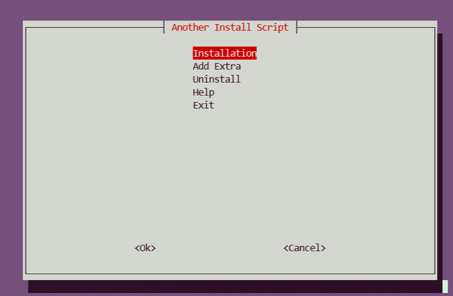

# another-install-script

[](https://travis-ci.com/antoinebou13/another-install-script)


Another install Script is a W.I.P project/script to install docker container for my personal server



## The story behind the project

I started working on the project because I just bought a VPS to host my TeamSpeak and Minecraft server.
After navigating [r/selfhosting](https://www.reddit.com/r/selfhosted), I saw the multiple of several services/servers that can be simply installed with docker. After learning more on docker and docker-compose to create bash project install script using Test-driven development and documented install script. Also, I found multiple repos that tries to do the same thing with their favorite container [IOStack](https://github.com/gcgarner/IOTstack) and [sovereign](https://github.com/sovereign/sovereign) and [MediaServerDockerCompose](https://github.com/vaeyo/MediaServer-DockerComposeFiles). I am trying to do with this project is to make a simple, extensible and customizable script to add a lot of selfhosted services/servers to easy to install with a simple cli menu. The project is a super easy install script for beginner/intermediate linux power user that want to test quickly interesting docker images of server/service. The project isn't a highly configurable install script with a container orchestrator and general manager for multiple docker.

## How to install

For now only work on ubuntu and only tested on ubuntu18.04

```bash
git clone --recursive https://github.com/antoinebou13/another-install-script.git
cd another-install-script
sudo bash install.sh
```

### Uninstall

```bash
cd another-install-script
sudo bash install.sh
```

## List of the services/server

Some services/servers cannot be installed at the same time
Also more configuration needed for certain services/servers

<details>
<summary>List</summary>
<br>
<table>
  <tr>
    <th>Name</th>
    <th>Description</th>
    <th>Ports</th>
    <th>Web server</th>
    <th>Implemented</th>
  </tr>
  <tr>
    <td>[airsonic](https://github.com/linuxserver/docker-airsonic)</td>
    <td>Music and Podcast server</td>
    <td>[4040, 1900]</td>
    <td>:4040</td>
    <td>✔️</td>
  </tr>
  <tr>
    <td>[bitwarden](https://github.com/bitwarden)</td>
    <td>Open source password management</td>
    <td>[8000]</td>
    <td>:8000</td>
    <td>❌</td>
  </tr>
  <tr>
    <td>[bookstack](https://www.bookstackapp.com/)</td>
    <td>Simple, self-hosted, easy-to-use platform for organising and storing information</td>
    <td>[6875]</td>
    <td>:6875</td>
    <td>✔️</td>
  </tr>
  <tr>
    <td>[calibre](https://github.com/kovidgoyal/calibre)</td>
    <td>Powerful and easy to use e-book manager</td>
    <td>[8001,8002]</td>
    <td>:8001, :8002</td>
    <td>✔️</td>
  </tr>
  <tr>
    <td>[cloud-torrent](https://github.com/jpillora/cloud-torrent)</td>
    <td>A self-hosted remote torrent client</td>
    <td>[6889]</td>
    <td>:6889</td>
    <td>✔️</td>
  </tr>
  <tr>
    <td>[code-server](https://github.com/cdr/code-server)</td>
    <td>Run VS Code on a remote server</td>
    <td>[8003]</td>
    <td>:8003</td>
    <td>❌</td>
  </tr>
  <tr>
    <td>[couchpotato](https://github.com/CouchPotato/CouchPotatoServer)</td>
    <td>Automatic Movie Downloading via NZBs &amp; Torrents</td>
    <td>[5050]</td>
    <td>:5050</td>
    <td>❌</td>
  </tr>
  <tr>
    <td>[cyberchef](https://github.com/gchq/CyberChef)</td>
    <td>The Cyber Swiss Army Knife - a web app for encryption, encoding, compression and data analysis</td>
    <td>[8004]</td>
    <td>:8004</td>
    <td>❌</td>
  </tr>
  <tr>
    <td>[deluge](https://github.com/deluge-torrent/deluge)</td>
    <td>BitTorrent Client</td>
    <td>❌</td>
    <td></td>
    <td>❌</td>
  </tr>
  <tr>
    <td>[drawio](https://hub.docker.com/r/fjudith/draw.io)</td>
    <td>Free online diagram software</td>
    <td>[8005]</td>
    <td>:8005</td>
    <td>✔️</td>
  </tr>
  <tr>
    <td>[duplicati](https://hub.docker.com/r/linuxserver/duplicati/)</td>
    <td>Backup software to store encrypted backups</td>
    <td>[8200]</td>
    <td>:8200</td>
    <td>❌</td>
  </tr>
  <tr>
    <td>[firefly-iii](https://www.firefly-iii.org/)</td>
    <td>A free and open source personal finance manager</td>
    <td>[8006]</td>
    <td>:8006</td>
    <td>❌</td>
  </tr>
  <tr>
    <td>[freshrss](https://hub.docker.com/r/linuxserver/freshrss)</td>
    <td>A free, self-hostable aggregator RSS</td>
    <td>[8007]</td>
    <td>:8007</td>
    <td>✔️</td>
  </tr>
  <tr>
    <td>[gitea](https://gitea.io/en-us/)</td>
    <td>A painless self-hosted Git service</td>
    <td>[8008, 222]</td>
    <td>:8008</td>
    <td>✔️</td>
  </tr>
  <tr>
    <td>[gitlab](https://hub.docker.com/r/gitlab/gitlab-ce/)</td>
    <td>Gitlab service self-hosted</td>
    <td>[8009, 22222]</td>
    <td>:8009</td>
    <td>✔️</td>
  </tr>
  <tr>
    <td>[glances](https://nicolargo.github.io/glances/)</td>
    <td>Cross-platform system monitoring tool written in Python.</td>
    <td>❌</td>
    <td></td>
    <td>❌</td>
  </tr>
  <tr>
    <td>[grafana](https://grafana.com/)</td>
    <td>The open source analytics and monitoring solution</td>
    <td>[8011]</td>
    <td>:8011</td>
    <td>❌</td>
  </tr>
  <tr>
    <td>[graylog](https://docs.graylog.org/en/3.1/pages/installation/docker.html)</td>
    <td>Free and open source log management</td>
    <td>[9000,1514, 12201]</td>
    <td>:9000</td>
    <td>❌</td>
  </tr>
  <tr>
    <td>[guacamole](https://github.com/oznu/docker-guacamole)</td>
    <td>Apache guacamole is clientless remote desktop gateway</td>
    <td>[8012]</td>
    <td>:8012</td>
    <td>✔️</td>
  </tr>
  <tr>
    <td>[headphones](https://hub.docker.com/r/linuxserver/headphones/)</td>
    <td>Automated music downloader for NZB and Torrent, written in Python</td>
    <td>[8181]</td>
    <td>:8181</td>
    <td>❌</td>
  </tr>
  <tr>
    <td>[heimdall](https://hub.docker.com/r/linuxserver/heimdall/)</td>
    <td>An Application dashboard and launcher</td>
    <td>[8080]</td>
    <td>:8080</td>
    <td>✔️</td>
  </tr>
  <tr>
    <td>[huginn](https://github.com/huginn/huginn)</td>
    <td>Create agents that monitor and act on your behalf</td>
    <td>[8013]</td>
    <td>:8013</td>
    <td>✔️</td>
  </tr>
  <tr>
    <td>[invidious](https://github.com/omarroth/invidious)</td>
    <td>alternative front-end to YouTube</td>
    <td>[8014]</td>
    <td>:8014</td>
    <td>❌</td>
  </tr>
  <tr>
    <td>[jackett](https://github.com/Jackett/Jackett)</td>
    <td>API Support for your favorite torrent trackers</td>
    <td>[9117]</td>
    <td>❌</td>
    <td>❌</td>
  </tr>
  <tr>
    <td>[jellyfin](https://jellyfin.org/)</td>
    <td>Free Software Media System also alternative for plex</td>
    <td>[8096, 8920]</td>
    <td>:8096</td>
    <td>❌</td>
  </tr>
  <tr>
    <td>[jenkins](https://jenkins.io/)</td>
    <td>Open source automation server CI/CD</td>
    <td>[8015, 50000]</td>
    <td>:8015</td>
    <td>❌</td>
  </tr>
  <tr>
    <td>[jupyterhub](https://github.com/jupyterhub/jupyterhub)</td>
    <td>Multi-user server for Jupyter notebooks</td>
    <td>[8028]</td>
    <td>:8028</td>
    <td>❌</td>
  </tr>
  <tr>
    <td>[jupyterlab](https://jupyterlab.readthedocs.io/en/stable/)</td>
    <td>Single-user server for Jupyter notebooks</td>
    <td>[8888]</td>
    <td>:8888</td>
    <td>❌</td>
  </tr>
  <tr>
    <td>[keycloak](https://www.keycloak.org/)</td>
    <td>Open source identity and access management</td>
    <td>[8050]</td>
    <td>:8050</td>
    <td>❌</td>
  </tr>
  <tr>
    <td>[komga](https://github.com/gotson/komga)</td>
    <td>Media server for comics/mangas/BDs with API and OPDS support</td>
    <td>[8031]</td>
    <td>:8031</td>
    <td>❌</td>
  </tr>
  <tr>
    <td>[liberapay](https://en.liberapay.com/)</td>
    <td>Recurrent donations platform like Patreon</td>
    <td>[8339]</td>
    <td>:8339</td>
    <td>❌</td>
  </tr>
  <tr>
    <td>[libresignage](https://github.com/eerotal/LibreSignage)</td>
    <td>An open source digital signage solution</td>
    <td>[8030]</td>
    <td>:8030</td>
    <td>❌</td>
  </tr>
  <tr>
    <td>[lodestone](https://github.com/AnalogJ/lodestone)</td>
    <td>Personal Document Archiving (DMS, EDMS for Personal/Home Office use)</td>
    <td>[8034]</td>
    <td>:8034</td>
    <td>❌</td>
  </tr>
  <tr>
    <td>[lychee](https://github.com/electerious/Lychee)</td>
    <td>A great looking and easy-to-use photo-management-system you can run on your server, to manage and share photos</td>
    <td>[8035]</td>
    <td>:8035</td>
    <td>✔️</td>
  </tr>
  <tr>
    <td>[mailcow](https://mailcow.email/)</td>
    <td>Mailserver docker</td>
    <td>[8036]</td>
    <td>❌</td>
    <td>❌</td>
  </tr>
  <tr>
    <td>[mango](https://github.com/hkalexling/Mango)</td>
    <td>Manga server and web reader</td>
    <td>[8036]</td>
    <td>:8036</td>
    <td></td>
  </tr>
  <tr>
    <td>[mcmyadmin](https://www.mcmyadmin.com/)</td>
    <td>Minecraft admin system</td>
    <td>[8037, 25565]</td>
    <td>:8037</td>
    <td>❌</td>
  </tr>
  <tr>
    <td>[medusa](https://github.com/pymedusa/Medusa)</td>
    <td>Automatic Video Library Manager for TV Shows</td>
    <td>[8038]</td>
    <td>:8038</td>
    <td>❌</td>
  </tr>
  <tr>
    <td>[minecraft](https://hub.docker.com/r/itzg/minecraft-server)</td>
    <td>Minecraft Server</td>
    <td>[25565]</td>
    <td>❌</td>
    <td>❌</td>
  </tr>
  <tr>
    <td>[monica](https://github.com/monicahq/monica)</td>
    <td>Personal CRM. Remember everything about your friends and family</td>
    <td>[8039]</td>
    <td>:8039</td>
    <td>❌</td>
  </tr>
  <tr>
    <td>[mylar](https://hub.docker.com/r/linuxserver/mylar)</td>
    <td>Automated Comic Book downloader</td>
    <td>[8090]</td>
    <td>:8090</td>
    <td>❌</td>
  </tr>
  <tr>
    <td>[neko](https://github.com/nurdism/neko)</td>
    <td>A self hosted virtual browser (rabb.it clone) that runs in docker.</td>
    <td>[8032]</td>
    <td>:8032</td>
    <td>✔️</td>
  </tr>
  <tr>
    <td>[netdata](https://github.com/netdata/netdata)</td>
    <td>Real-time performance monitoring, done right!</td>
    <td>[19999]</td>
    <td>:19999</td>
    <td>❌</td>
  </tr>
  <tr>
    <td>[nextcloud](https://github.com/nextcloud)</td>
    <td>On-premises file share and collaboration platform</td>
    <td>[9321]</td>
    <td>:9321</td>
    <td>❌</td>
  </tr>
  <tr>
    <td>[olaris](https://gitlab.com/olaris/olaris-server)</td>
    <td>Media Manager and transcoding server</td>
    <td>[8043]</td>
    <td>:8043</td>
    <td>❌</td>
  </tr>
  <tr>
    <td>[open-streaming-platform](https://gitlab.com/Deamos/flask-nginx-rtmp-manager)</td>
    <td>A Self-Hosted Video Streaming and Recording Server Using Python, Flask, Nginx-RTMP</td>
    <td>[1935, 8585, 8553]</td>
    <td>:8585, :8553</td>
    <td>❌</td>
  </tr>
  <tr>
    <td>[openldap](https://github.com/osixia/docker-openldap)</td>
    <td>Open Source implementation of the Lightweight Directory Access Protocol.</td>
    <td>[389,636]</td>
    <td>❌</td>
    <td>❌</td>
  </tr>
  <tr>
    <td>[openvpn](https://github.com/kylemanna/docker-openvpn)</td>
    <td>Open Source VPN</td>
    <td>[1194]</td>
    <td>❌</td>
    <td>❌</td>
  </tr>
  <tr>
    <td>[paperless](https://github.com/the-paperless-project/paperless)</td>
    <td>Scan, index, and archive all of your paper documents</td>
    <td>[8047]</td>
    <td>:8047</td>
    <td>❌</td>
  </tr>
  <tr>
    <td>[piwigo](https://hub.docker.com/r/linuxserver/piwigo/)</td>
    <td>Photo gallery software</td>
    <td>[8049]</td>
    <td>:8049</td>
    <td>❌</td>
  </tr>
  <tr>
    <td>[plex](https://www.plex.tv/fr/)</td>
    <td>Organize, beautify, stream, and share your personal collection of movies, TV, music, and photos</td>
    <td>[8050]</td>
    <td>:8050</td>
    <td>❌</td>
  </tr>
  <tr>
    <td>[portainer](https://www.portainer.io/)</td>
    <td>Build and manage your Docker environments with ease today</td>
    <td>[9001]</td>
    <td>:9001</td>
    <td>❌</td>
  </tr>
  <tr>
    <td>[privatebin](https://privatebin.info/)</td>
    <td>A minimalist, open source online pastebin where the server has zero knowledge of pasted data</td>
    <td>[8052]</td>
    <td>:8052</td>
    <td>❌</td>
  </tr>
  <tr>
    <td>[pyload](https://pyload.net/)</td>
    <td>Open Source download manager and designed to be extremely lightweight, easily extensible and fully manageable via web</td>
    <td>[8053,7227]</td>
    <td>:8053</td>
    <td>❌</td>
  </tr>
  <tr>
    <td>[qbittorent-vpn](https://hub.docker.com/r/markusmcnugen/qbittorrentvpn/)</td>
    <td>Open Source software alternative to µTorrent with VPN</td>
    <td>[8054,6969]</td>
    <td>:8054</td>
    <td>❌</td>
  </tr>
  <tr>
    <td>[recipes](https://github.com/vabene1111/recipes)</td>
    <td>Django application for managing recipes</td>
    <td>[8055]</td>
    <td>:8055</td>
    <td>❌</td>
  </tr>
  <tr>
    <td>[rocketchat](https://rocket.chat/docs/installation/docker-containers/)</td>
    <td>Open Source Team Communication, replace email, HipChat &amp; Slack</td>
    <td>[8056, 3001]</td>
    <td>:8056</td>
    <td>❌</td>
  </tr>
  <tr>
    <td>[shiori](https://github.com/go-shiori/shiori)</td>
    <td>Simple bookmark manager built with Go</td>
    <td>[8058]</td>
    <td>:8058</td>
    <td>❌</td>
  </tr>
  <tr>
    <td>[sonarr](https://github.com/smicallef/spiderfoot)</td>
    <td>Smart PVR for newsgroup and bittorrent users.</td>
    <td>[8059]</td>
    <td>:8059</td>
    <td>❌</td>
  </tr>
  <tr>
    <td>[spiderfoot](https://github.com/smicallef/spiderfoot)</td>
    <td>Intelligence (OSINT) automation tool</td>
    <td>[8060]</td>
    <td>:8060</td>
    <td>❌</td>
  </tr>
  <tr>
    <td>[statping](https://github.com/hunterlong/statping)</td>
    <td>Status Page for monitoring your websites and applications with beautiful graphs, analytics, and plugins</td>
    <td>[8061]</td>
    <td>:8061</td>
    <td>❌</td>
  </tr>
  <tr>
    <td>[syncthing](https://github.com/syncthing/syncthing)</td>
    <td>Open Source Continuous File Synchronization</td>
    <td>[8384, 22000]</td>
    <td>:8384</td>
    <td>❌</td>
  </tr>
  <tr>
    <td>[tautulli](https://github.com/HaveAGitGat/Tdarr)</td>
    <td>Monitor your Plex Media Server</td>
    <td>[8063]</td>
    <td>:8063</td>
    <td>❌</td>
  </tr>
  <tr>
    <td>[tdarr](https://github.com/HaveAGitGat/Tdarr)</td>
    <td>Tdarr Beta -Audio/Video library analytics + transcode automation using FFmpeg/HandBrake + video health checking</td>
    <td>[8064]</td>
    <td>:8064</td>
    <td>❌</td>
  </tr>
  <tr>
    <td>[teamspeak](https://github.com/solidnerd/docker-teamspeak)</td>
    <td>Voice Chat Application</td>
    <td>[9987, 10011, 30033]</td>
    <td>❌</td>
    <td>✔️</td>
  </tr>
  <tr>
    <td>[ubuntuxrdp](https://github.com/danielguerra69/ubuntu-xrdp)</td>
    <td>An Ubuntu Desktop with xrdp server can be use with Apache Guacamole</td>
    <td>[3389,2232]</td>
    <td>❌</td>
    <td>✔️</td>
  </tr>
  <tr>
    <td>[wallabag](https://github.com/wallabag/wallabag)</td>
    <td>Save and classify articles, Read them later, Freely</td>
    <td>[8899]</td>
    <td>:8899</td>
    <td>✔️</td>
  </tr>
  <tr>
    <td>[wireguard](https://github.com/WireGuard)</td>
    <td>VPN Server</td>
    <td>[5555]</td>
    <td>❌</td>
    <td>❌</td>
  </tr>
  <tr>
    <td>[ansible](https://www.ansible.com/integrations/containers/docker)</td>
    <td>IT Systems automation</td>
    <td>❌</td>
    <td>❌</td>
    <td>✔️</td>
  </tr>
  <tr>
    <td>[cockpit](https://cockpit-project.org/)</td>
    <td>Open web-based interface for your servers</td>
    <td>[9090]</td>
    <td>:9090</td>
    <td>✔️</td>
  </tr>
  <tr>
    <td>[cockpit](https://cockpit-project.org/)</td>
    <td>Open web-based interface for your servers</td>
    <td>[9090]</td>
    <td>:9090</td>
    <td>✔️</td>
  </tr>
</table>
</details>

Go to the [Google Sheet](https://drive.google.com/file/d/1s2Il9qeJdZj-NYnzfveIW-HfnRhwkce-/view?usp=sharing)

## List of other installed program

- build-essential
- git
- python3
- python3-pip
- wireless-tools
- wpasupplicant
- default-jre
- jq
- net-tools
- firefox
- [vim](https://www.vim.org/)
- [snapd](https://snapcraft.io/)
- [nnn](https://github.com/jarun/nnn)
- [nmap](https://nmap.org/)
- [wget](https://www.gnu.org/software/wget/)
- [curl](https://github.com/curl/curl)
- [mlocate](https://wiki.archlinux.org/index.php/Mlocate)
- [cmake](https://cmake.org/)
- [docker](https://www.docker.com/)
- [docker-compose](https://docs.docker.com/compose/)
- [dry](https://github.com/moncho/dry)
- [emojify](https://github.com/mrowa44/emojify)
- [signal-cli](https://github.com/AsamK/signal-cli)

## Project Structure

A simple project overview to with the explaination of each important file

```bash
+-- docs
|   +-- vendor
|       +-- ...
|   +-- docs.md
|   +-- generate_docs.md
+-- etc
|   +-- ...
+-- src
|   +-- images
|   |   +-- $container_name
|   |   |   |    +-- docker-compose.yml
|   |   |   |    +-- $container_name.sh
|   |   |   |    +-- ...
|   +-- docker.sh
|   +-- container.sh
|   +-- install.sh
|   +-- menu.sh
|   +-- utils.sh
+-- setup.sh
+-- uninstall.sh
```

| Path                        |                           Explanation                            |
| --------------------------- | :--------------------------------------------------------------: |
| docs                        | The directory for the documentation for the code and the project |
| docs/vendor                 |         The vendor program to generate the documentation         |
| src                         |              The path for the code for the project               |
| src/images/\$container_name |  The path for docker container with a script and docker-compose  |

## How to run coverage and tests

[Manuel Testing](docs/TESTING.md)

For running the [bats](https://github.com/bats-core/bats-core) tests

```bash
cd tests
bash test.sh
```

For running and generate with [kcov](https://github.com/SimonKagstrom/kcov)

```bash
cd tests
bash coverage.sh
```

## How to generate the documentation

For running and generate the documentation with [shdoc](https://github.com/reconquest/shdoc)

```bash
git submodule update --init --recursive
git pull --recurse-submodules
git submodule update --remote
cd docs/generator
chmod +x generate_docs.sh
bash generate_docs.sh ../docs.md
```

## Documentation

Go to [Documentation](docs/docs.md)

## Code of Conduct

Go to [Code of Conduct](.github/CODE_OF_CONDUCT.md)

## Contributing


Go to [Contributing](.github/CONTRIBUTING.md)

## Changelog

Go to [Changelog](docs/CHANGELOG.md)

## License

Go to [License](.github/LICENSE)

## Roadmap

- [] Auto vm creatation for ci and personnal use
- [] Add traefik reverse proxy with subdomain for each docker container
- [] Easier config file or adding yml file to individual folder
- [] More docker container and images
- [] Automatic docker compose and container update
- [] Automatic backup
- [] Automatic testing and better coverage
- [] Versionning
- [] Better cli menu
- [] Rewrite in python
