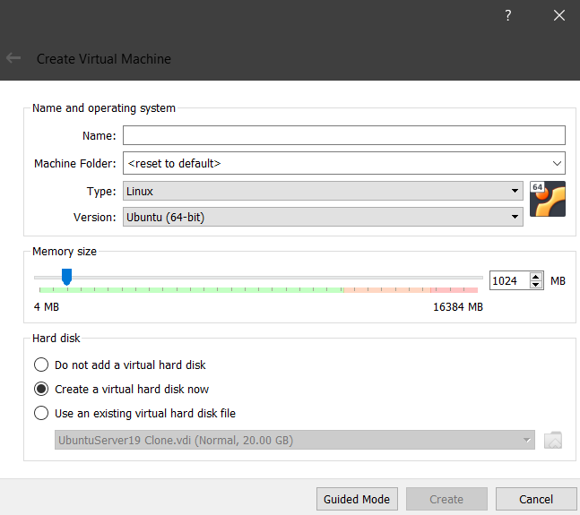

# Testing

[Download Ubuntu server](https://ubuntu.com/download/server)

## Manuel Testing

Using virtual machine you can test the install script manually

### VirtualBox

[Virtualbox](https://www.virtualbox.org/wiki/Downloads)

- 
- 
- Install the minimal installation of ubuntu
- Restart VM
- Port forwarding 127.0.0.1:2222 -> 10.0.2.15:22
- `DISPLAY=localhost:0 ssh -X username@127.0.0.1 -p 2222`


```bash
sudo apt-get install bats firefox

git clone --recursive https://github.com/antoinebou13/another-install-script.git
cd another-install-script

cd tests
bash tests.sh
cd ..

bash install.sh
```

### Qemu


```bash
sudo apt-get install qemu-kvm qemu virt-manager virt-viewer libvirt-bin
qemu-img create -f qcow2 ubuntu.qcow 20G
qemu-system-x86_64 -hda ubuntu.qcow -boot d -cdrom </path_to_iso> -m 2000 -redir tcp:2222::22
# Install the minimal installation of ubuntu
qemu -hda ubuntu.qcow -m 2000
```

`DISPLAY=localhost:0 ssh -X username@127.0.0.1 -p 2222`

```bash
sudo apt-get install bats
git clone --recursive https://github.com/antoinebou13/another-install-script.git
cd another-install-script

cd tests
bash tests.sh
cd ..

bash install.sh
```
